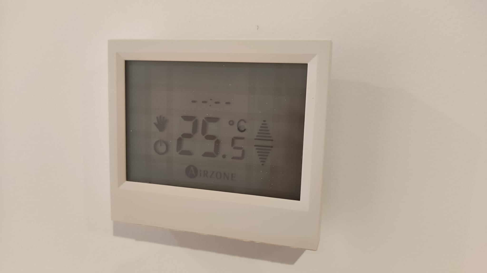
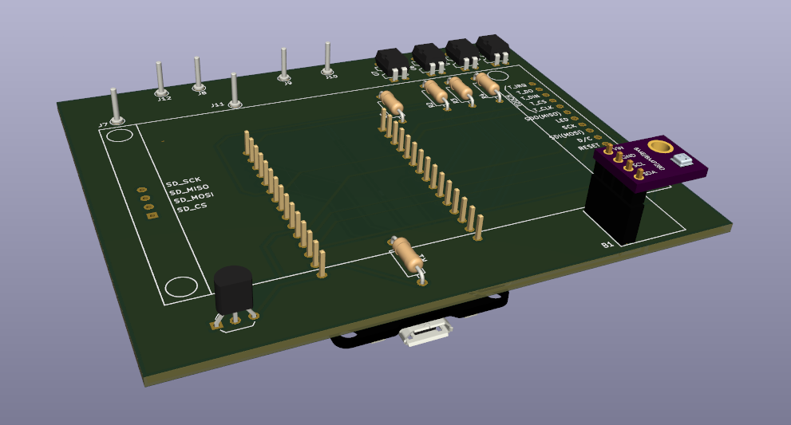
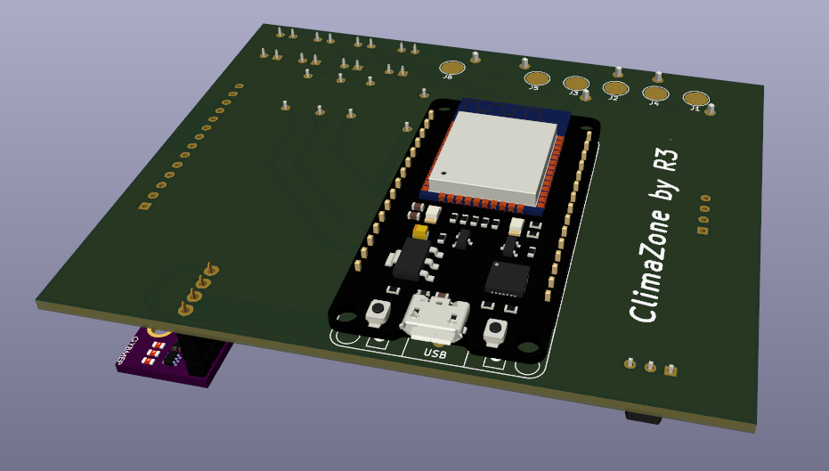
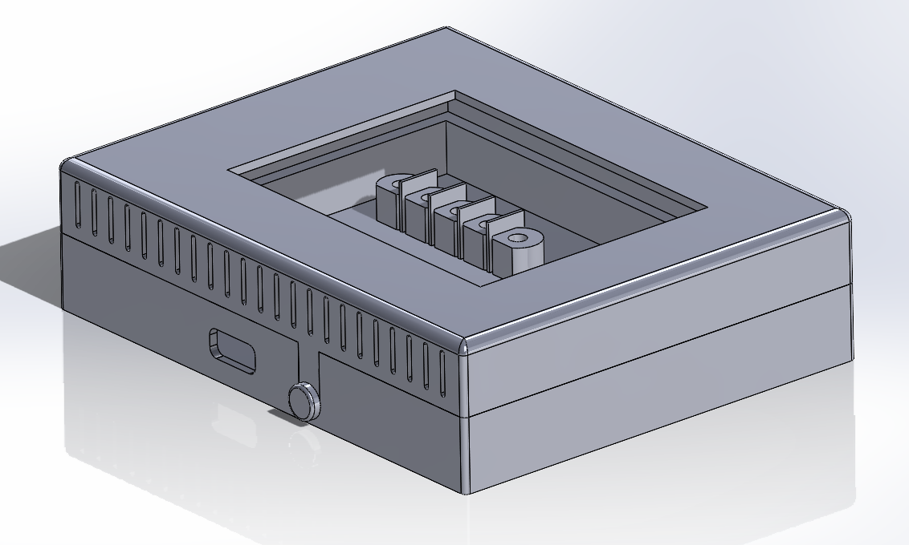

# ClimaZone

Room console interface to Airzone control system, meant to replace old panels, like this one:

## Bill of materials
 - ESP32 DevKit V1 DOIT
 - TFT Touch screen 2.8" 240x320 (SD + SPI)
 - BME280 I2C
 - DS18B20
 - PC817 x 4
 - 1k resistor x 4
 - 5k resistor x 1

## PCB Design
PCB design has been carried out using Kicad 6.0. The PCB is compatible both with master and slave consoles.

The temperature console is based on an ESP32 with a touch screen as an interface. It uses a DS18B20 for temperature measurement and a BME280 to measure humidity and pressure. Finally, the outputs are activated using PC817 optocouplers.

In the project there have been used 3 kicad libraries, which are already packaged:
 - https://gitlab.com/VictorLamoine/kicad/-/tree/master/ @ Victor Lamoine
 - https://github.com/colesnicov/kicad-TFT-Displays @ Colesnicov Denis
 - https://github.com/Pingoin/Pingolib-Kicad @ Pingoin

PCB Front               |  PCB Rear
:----------------------:|:-----------------------:
  |  

## Case design and installation (TODO)
The case is designed to replace the old control panel, thus using the same interface bolts, as can be seen in the following picture.

[image] TODO

The design is composed of 3 elements, all of them can be 3D printed:
- The bottom part, which is bolted to the wall
- The top part, which encloses the PCB
- A plastic "bolt" which keeps the other parts held together

## Software (TODO)
...
